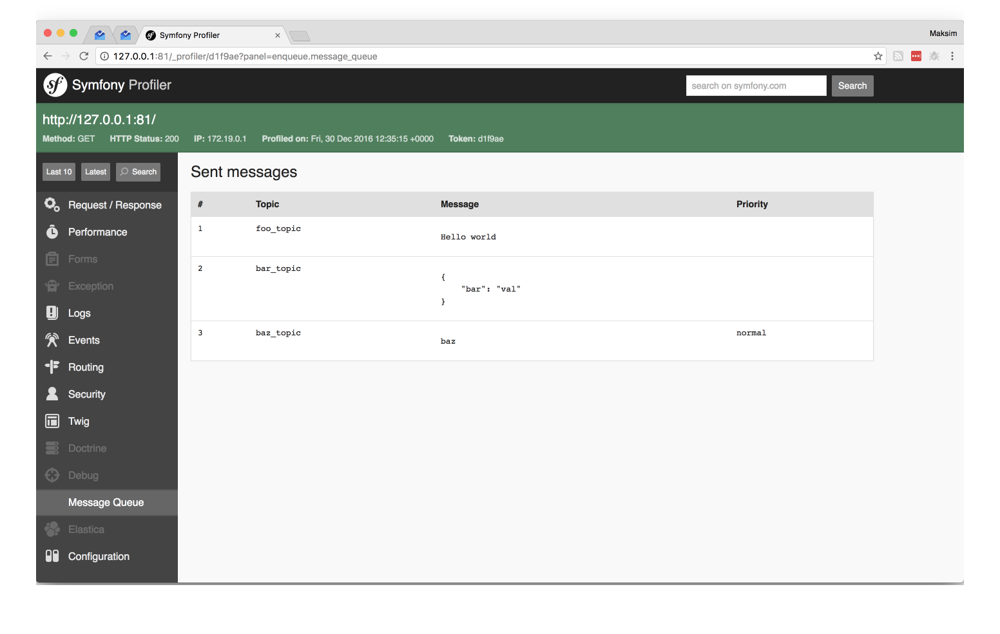
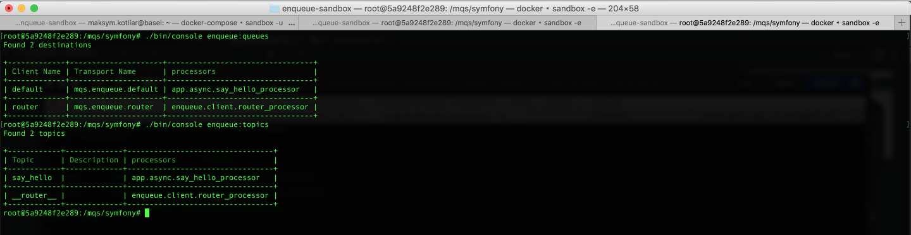
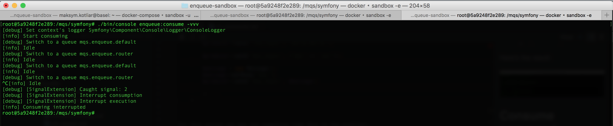



# 调试

## 分析器

查看在HTTP请求期间发送的消息可能很有用。该扩展程序收集所有发送的消息
本包为 Symfony[分析器](http://symfony.com/doc/current/profiler.html) 提供了一个收集器。
该扩展会收集所有发送的消息

启用分析器

```yaml
# app/config/config_dev.yml

enqueue:
    default:
        client:
            traceable_producer: true
```

现在假设你在一个动作中有这个代码：

```php
<?php

use Symfony\Bundle\FrameworkBundle\Controller\Controller;
use Symfony\Component\HttpFoundation\Request;
use Enqueue\Client\Message;
use Enqueue\Client\ProducerInterface;

class DefaultController extends Controller
    /**
     * @Route("/", name="homepage")
     */
    public function indexAction(Request $request)
    {
        /** @var ProducerInterface $producer */
        $producer = $this->get('enqueue.producer');

        $producer->sendEvent('foo_topic', 'Hello world');

        $producer->sendEvent('bar_topic', ['bar' => 'val']);

        $message = new Message();
        $message->setBody('baz');
        $producer->sendEvent('baz_topic', $message);

        // ...
    }

```

对于此操作，您可能会在分析器中看到如下内容：



## 可用的队列和主题

有两个控制台命令：`./bin/console enqueue:queues` 和 `./bin/console enqueue:topics`。
它们在这里帮助您了解有关现有主题和队列的更多信息。

结果如下：



## 消费命令冗余度

默认情况下，`enqueue:consume` 或 `enqueue:transport:consume` 命令不输出任何内容。
您可以添加 `-vvv` 以查看更多信息。



[返回首页](index.md)