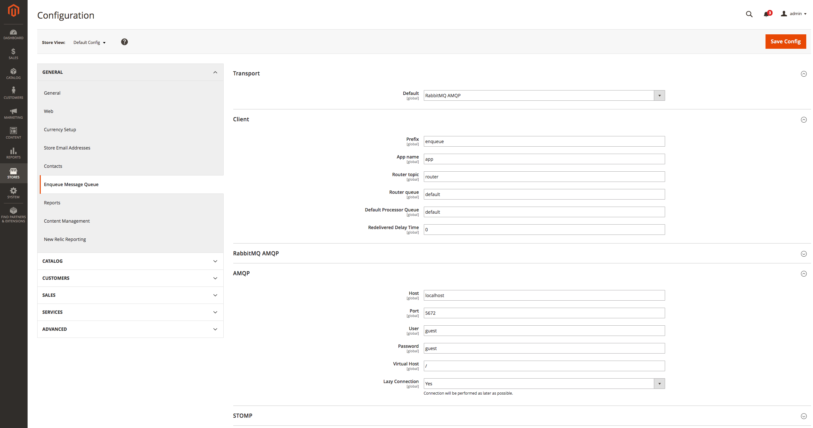



# Magento2 EnqueueModule

本模块将 [Enqueue Client](../client/quick_tour.md) 与 Magento2 集成在一起。您可以向不同的消息队列发送和消费消息，例如 RabbitMQ、AMQP、STOMP、Amazon SQS、Kafka、Redis、Google PubSub、Gearman、Beanstalk、Google PubSub 等。或者通过 [Message Bus](../client/message_bus.md) 将 Magento2 应用与其他应用或服务集成。
Magento1 也有[一个模块](../magento/quick_tour.md)。

## 安装

我们推荐使用 [composer](https://getcomposer.org/) 来安装 [magento2-enqueue](https://github.com/php-enqueue/magento-enqueue) 模块。
要安装该库，请在应用根目录中运行命令：

```bash
$ composer require "enqueue/magento2-enqueue:*@dev" "enqueue/amqp-ext"
```

运行 `setup:upgrade`，以便 Magento2 选择已安装的模块。

```bash
$ php bin/magento setup:upgrade
```

## 配置

在这个阶段，我们已经在 Magento 后端配置了 Enqueue 扩展。
配置在这里：`System -> Configuration -> Enqueue Message Queue`。
这是连接到本地主机上的 RabbitMQ 代理的 Amqp 传输示例：



## 发布消息

要发送消息，您必须采用 enqueue 辅助并调用 `send` 方法。

```php
<?php

$objectManager = \Magento\Framework\App\ObjectManager::getInstance();
$enqueueManager = $objectManager->create('Enqueue\Magento2\Model\EnqueueManager');
$enqueueManager->sendEvent('a_topic', 'aMessage');

// 或者一个可能有答复的命令
$reply = $enqueueManager->sendCommand('a_topic', 'aMessage', true);

$replyMessage = $reply->receive(5000); // wait for 5 sec
```

## 消息消费

我假设您已正确创建、配置和注册了 `acme` Magento 模块。
要消费消息，您必须首先定义一个处理器类：

```php
<?php
// app/code/Acme/Module/Helper/Async/Foo.php

namespace Acme\Module\Helper\Async;

use Interop\Queue\PsrContext;
use Interop\Queue\PsrMessage;
use Interop\Queue\PsrProcessor;

class Foo implements Processor
{
    public function process(PsrMessage $message, PsrContext $context)
    {
        // do job
        // $message->getBody() -> 'payload'

        return self::ACK;         // acknowledge message
        // return self::REJECT;   // reject message
        // return self::REQUEUE;  // requeue message
    }
}
```

然后订阅一个主题或几个主题：


```xml
<!-- app/code/Acme/Module/etc/config.xml -->

<config>
  <default>
    <enqueue>
      <processors>
        <foo-processor>
          <topic>a_topic</topic>
          <helper>Acme\Module\Helper\Async\foo</helper>
        </foo-processor>
      </processors>
    </enqueue>
  </default>
</config>
```

并运行消息消费命令：

```bash
$ php bin/magento enqueue:consume -vvv --setup-broker
```

[返回目录](../index.md#magento2)