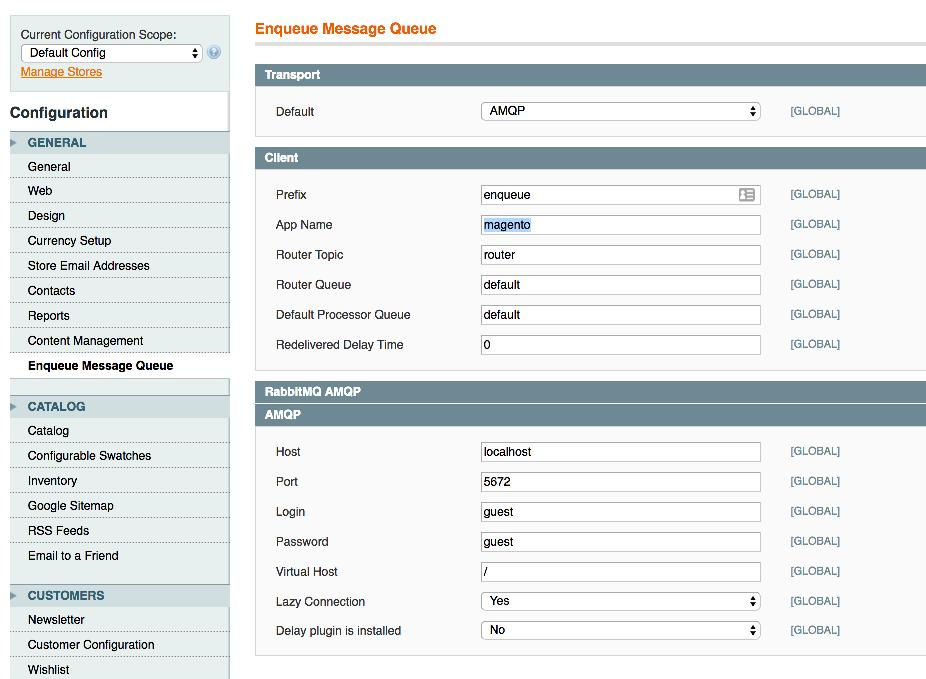



# 快速指南

.本模块将 [Enqueue Client](../client/quick_tour.md) 与 Magento1集成在一起。您可以向不同的消息队列发送和消费消息，例如 RabbitMQ、AMQP、STOMP、Amazon SQS、Kafka、Redis、Google PubSub、Gearman、Beanstalk、Google PubSub 等。或者通过 [Message Bus](../client/message_bus.md) 将 Magento2 应用与其他应用或服务集成。
Magento2 也有[一个模块](../magento2/quick_tour.md)。

## 安装

我们使用 [composer](https://getcomposer.org/) 和 [cotya/magento-composer-installer](https://github.com/Cotya/magento-composer-installer) 插件来安装 [magento-enqueue](https://github.com/php-enqueue/magento-enqueue) 扩展。

要安装该库，请在应用根目录中运行命令：

```bash
$ composer require "magento-hackathon/magento-composer-installer:~3.0"
$ composer require "enqueue/magento-enqueue:*@dev" "enqueue/amqp-ext"
```

_**注意**：您不仅仅可以使用 AMQP 传输，还可以使用任何其他可用的[传输](../transport)。_

## 配置

在这个阶段，我们已经在 Magento 后端配置了 Enqueue 扩展。
配置在这里：`System -> Configuration -> Enqueue Message Queue`。
这是连接到本地主机上的 RabbitMQ 代理的 Amqp 传输示例：




## 发布消息

要发送消息，您必须采用 enqueue 辅助并调用 `send` 方法。

```php
<?php

Mage::helper('enqueue')->send('a_topic', 'aMessage');
```

## 消息消费

我假设您已正确创建、配置和注册了 `acme` Magento 模块。
要消费消息，您必须首先定义一个处理器类：

```php
<?php
// app/code/local/Acme/Module/Helper/Async/Foo.php

use Interop\Queue\Context;
use Interop\Queue\Message;
use Interop\Queue\Processor;

class Acme_Module_Helper_Async_Foo implements Processor
{
    public function process(Message $message, Context $context)
    {
        // do job
        // $message->getBody() -> 'payload'

        return self::ACK;         // acknowledge message
        // return self::REJECT;   // reject message
        // return self::REQUEUE;  // requeue message
    }
}
```

然后订阅一个主题或几个主题：


```xml
<!-- app/etc/local.xml -->

<config>
  <default>
    <enqueue>
      <processors>
        <foo-processor>
          <topic>a_topic</topic>
          <helper>acme/async_foo</helper>
        </foo-processor>
      </processors>
    </enqueue>
  </default>
</config>
```

并运行消息消费命令：

```bash
$ php shell/enqueue.php enqueue:consume -vvv --setup-broker
```

[返回目录](../index.md)
